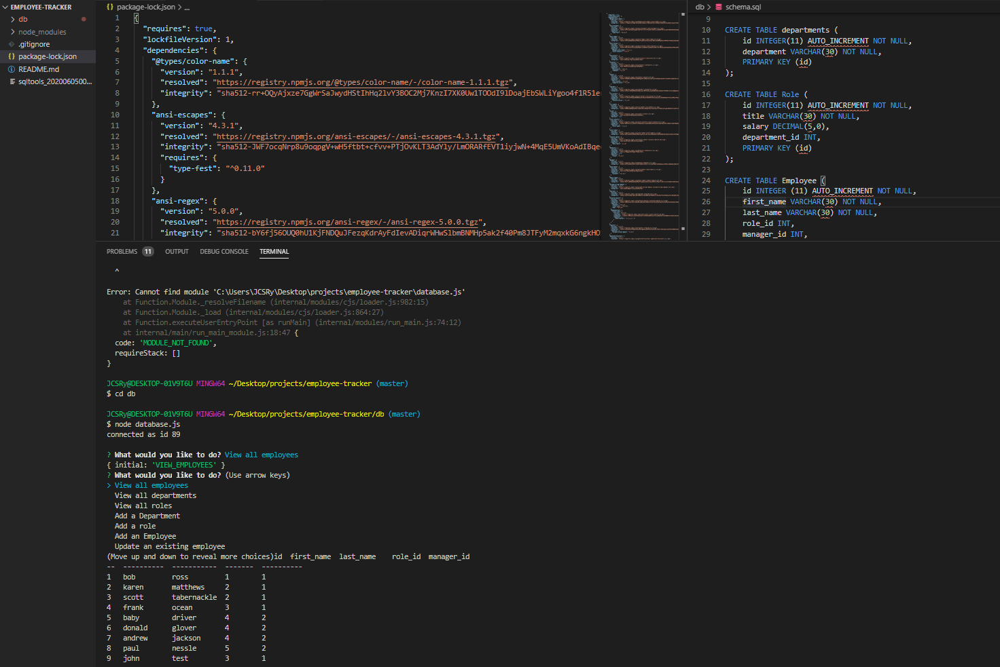

# employee-tracker

A simple application that creates and injects data into SQL tables to help organize and find data on employees in a ficticious company. 
All SQL tables are created in the schema file and initially populated with the seeds file via mysql2. 
From there using the inquirer package the user is able to manipulate add and delete data from the tables through JS functions that inject the pertinent SQL commands.
For ease of viewing and organization the package Console.table is used to more accuratly display the tables in the command prompt. 
To run this program please 'npm install' the three afore mentioned packages.

